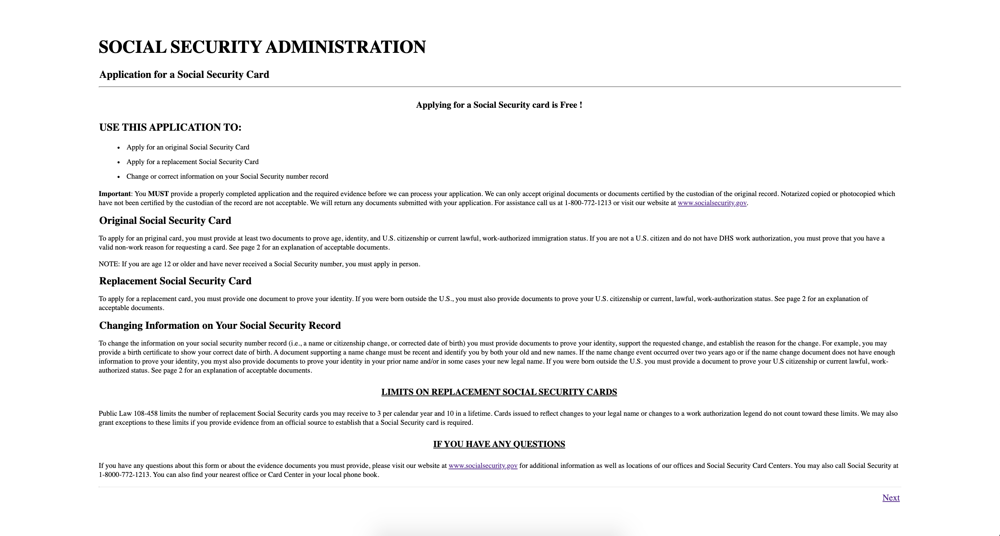
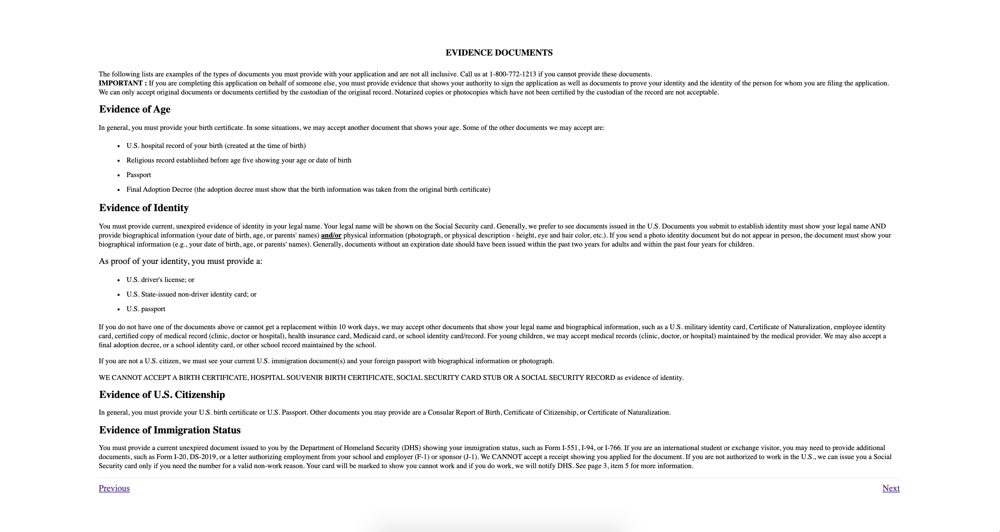
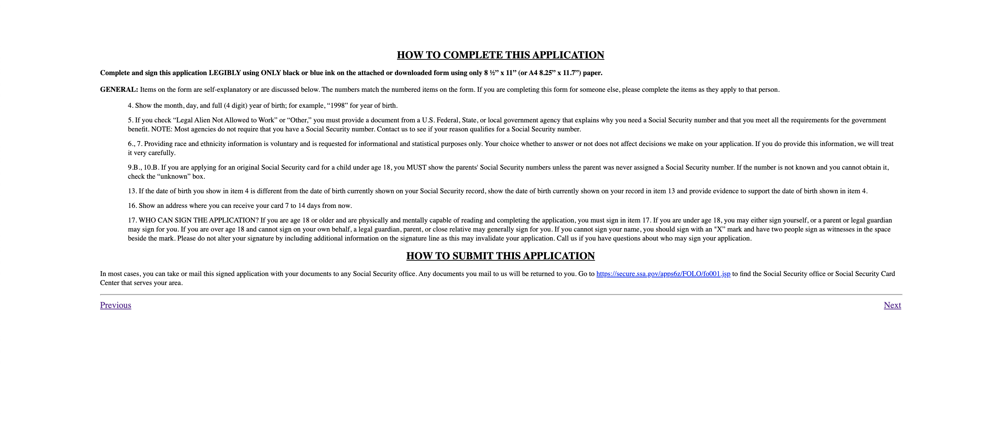
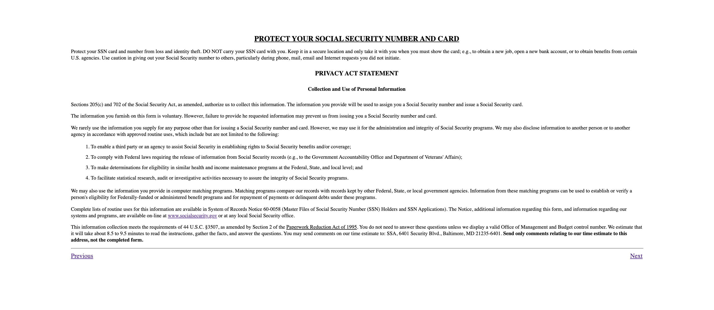
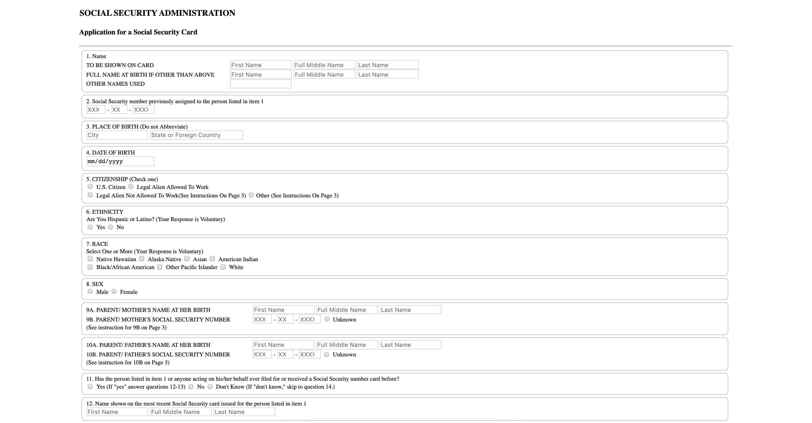
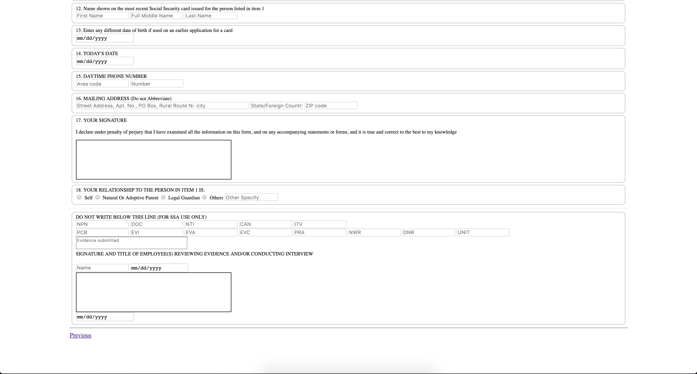

# assignment-1-cherukupallis 

This assigment is an online application of the Social security card. For people who wish to get a new card or replacement or change of information on Social Security Number record.

Creating the html pages using various html elements and attirbutes such as 
* header
* section
* aside 
* anchor 
* list tags ( ul and ol )
* headings ( h1, h2, h3 etc )
* p and div tags 
* form 
* input (of type text, radio button, checkbox, date, etc )

#### Getting Started

html folder contains each page of the pdf as single html files 

Page1.html

Page 2.html

Page 3.html

Page4.html

Page5.html (Part one)

### Author
* **Soumya Cherukupalli** - *NU001053800*  

# CellularAutomata 
This projects demonstrates 2D Cellular Automata Crystal Growth 

CACrystal : which holds a 2D Array of cells
CACell : helper class which defines the state of cells
CARule : which can assigns a new cell based on a prior crystal
CACrystalSet : holds multiple CACrystals and can call the CARule class repeatedly to generate a new crystal state

User Interface application : 
Selection field to choose an available Rules 
Input field to specify the maximum number of duration of the CA lifetime 
Start and Stop button to control the simulation 
Graphical display panel to display the results of CA Crystal Growth simulation 
