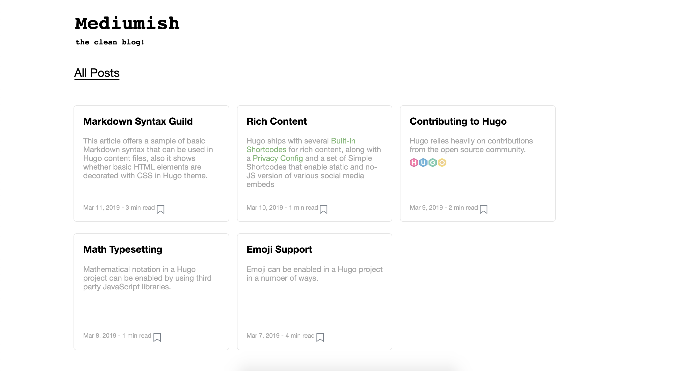

# assignment-3-cherukupallis

In this assigment we are creating a single page blog, using HTML and CSS. 

Creating the html page using various html elements and attributes such as 
* header, section, aside, anchor, headings ( h1, h2, h3 etc ), p and span tags 

And using external CSS to style the html 
* CSS Selectors, properties, pseudo-classes, pseudo-elements.

#### Getting Started

styles folder contains various css files used and index.html will be the start. 

index.html

### Author
* **Soumya Cherukupalli** - *NU001053800*  
