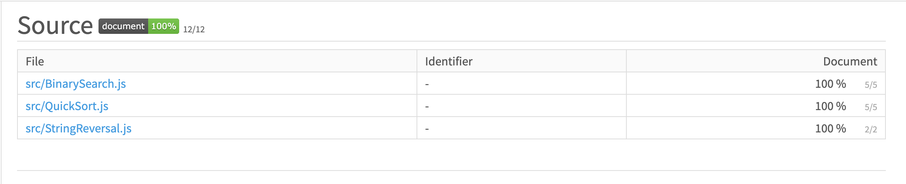

# assignment-5-cherukupallis
 
 In this assignment, we are understanding and implementing the following algorithms in JavaScript 
 1. QuickSort 
 2. Binary Search
 3. Reverse a string
 
 Implemented the above mentioned using - 
 
 * Datatypes - boolean, string, number, array etc 
 * Arithmetic operations  
 * Loops
 * Conditionals
 * Function
 
 ### Coverage
 

 
 ### Reference 
 * Quicksort : https://www.youtube.com/watch?v=SLauY6PpjW4
 * Binary search :  https://www.youtube.com/watch?v=P3YID7liBug
 
 ### Author
 * **Soumya Cherukupalli** - *NU001053800*  
  
